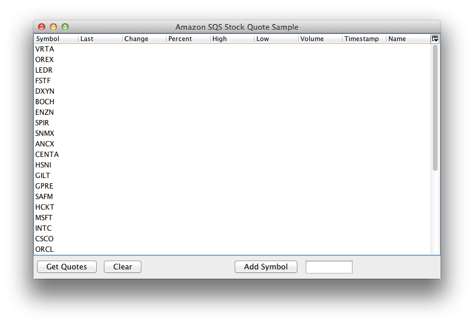
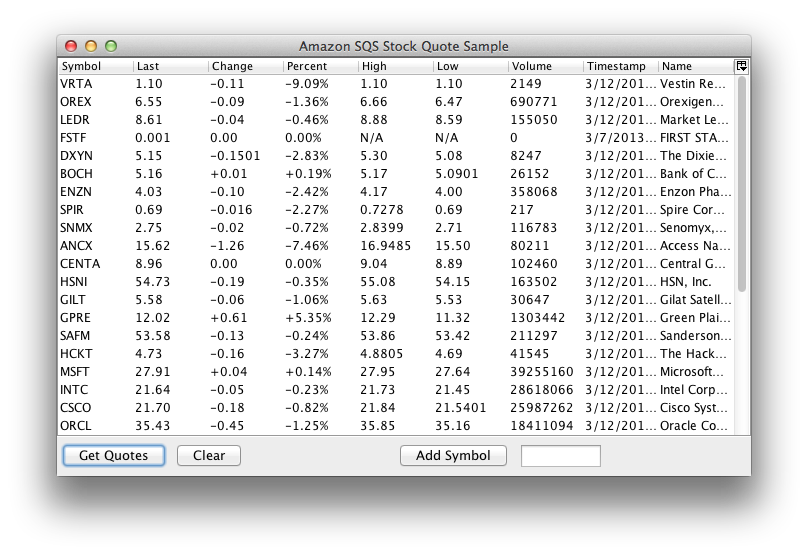
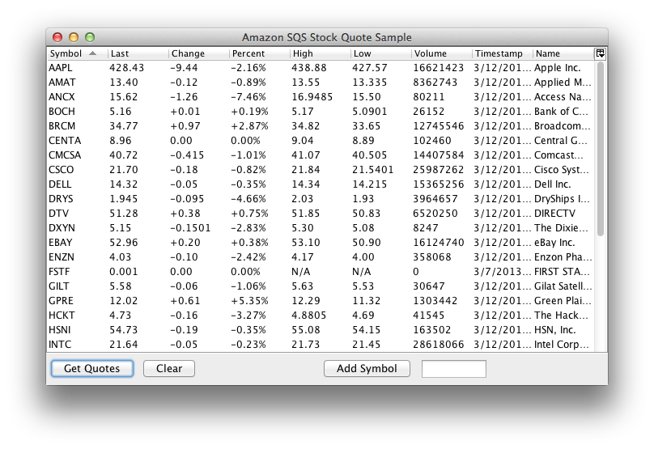
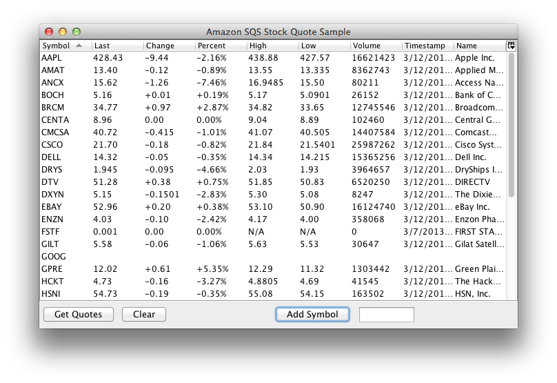

# stockquote

A sample Swing-based client that demonstrates how to use Amazon SQS (Simple 
Queue Service). The application is a simple stock information system, where
you can add stock symbols and get stock quotes for them.

The application is written in Clojure, using several Clojure libraries for
various tasks, such as:

* [bandalore](https://github.com/cemerick/bandalore/) for Amazon SQS access
* [seesaw](https://github.com/daveray/seesaw) for a better Swing experience
* [cheshire](https://github.com/dakrone/cheshire) for JSON encoding and decoding
* [clj-http](https://github.com/dakrone/clj-http) for HTTP client access
* [clojure.data.csv](https://github.com/clojure/data.csv) for CSV parsing

The application shows a table with preloaded stock symbols. When clicking the button
`Get Quotes`, each stock symbol is placed on an Amazon SQS work queue. This
queue can be polled by one or more workers. Each worker should grab a symbol
from the work queue, retrieve a stock quote for the symbol, and add the stock
quote result to a result queue. The client will poll the result queue using a
multi-threaded receiver, and update the GUI table with the retrieved results
accordingly.

The button `Clear` will clear the table form any stock information. New stock
symbols can be added by typing a stock symbol in the text field, like `GOOG`
or `AMZN` for example, and clicking `Add symbol`.

By default, the client starts its own multi-threaded worker, but it can also be
told to not start a worker. In the latter case, workers need to be provided by
other means, for example by starting workers as separate processes. More about
how to do that later.

## Quickstart

Run the client with Leiningen:

    $ lein run

## Installation

1. [Leiningen](https://github.com/technomancy/leiningen) is needed in order to compile 
the application. It will also make running it easier.

2. Make sure you have a file containing the AWS credentials for your account, including the
account number, which is used to identify the queues:

        $ cat ~/.aws.properties 
        {:aws.accessKeyId "some_access_key"
         :aws.secretKey "some_secret_key"
         :aws.account "some_account_number"}

3. Create two queues on Amazon SQS:

        * sqwork
        * sqresult

4. Make sure the account you're using has access to your SQS queues.

## Usage

### Starting the client with a worker

The client can be run in several ways. One way is via Leiningen:

    $ lein run

The application can also be compiled and packaged in a jar file containing all
dependencies:

    $ lein uberjar

The resulting jar file can be run directly:

    $ java -jar target/stockquote-0.1.0-SNAPSHOT-standalone.jar

It can also be run indirectly, with the main class specified:

    $ java -cp target/stockquote-0.1.0-SNAPSHOT-standalone.jar stockquote.client$_main

### Starting the client without a worker

With no arguments, the client starts its own worker. If you want to provide
your own workers, you can give `noworker` as an argument:

    $ java -cp target/stockquote-0.1.0-SNAPSHOT-standalone.jar noworker

### Starting a separate worker

The same jar file can be used to start a worker process as well:

    $ java -cp target/stockquote-0.1.0-SNAPSHOT-standalone.jar stockquote.worker$_main

### Getting queue information

The same jar file can also be used to get queue information. Without any argument, 
it will provide queue attributes for all the queues accessible by the account used:

    $ java -cp target/stockquote-0.1.0-SNAPSHOT-standalone.jar stockquote.queue$_main

One or more queue names can also be given as arguments:

    $ java -cp target/stockquote-0.1.0-SNAPSHOT-standalone.jar stockquote.queue$_main sqresult

## Options

* The `client` application accepts either no arguments or a `noworker` argument.
* The `worker` application accepts no arguments.
* The `queue` application accepts no arguments.

## Examples

### Starting a separate worker

    $ java -cp target/stockquote-0.1.0-SNAPSHOT-standalone.jar stockquote.worker$_main
    Listening for stock symbols on queue:
         https://sqs.eu-west-1.amazonaws.com/123456789012/sqwork 
    Writing quotes to queue:
         https://sqs.eu-west-1.amazonaws.com/123456789012/sqresult

### Queue information for all queues

    $ java -cp target/stockquote-0.1.0-SNAPSHOT-standalone.jar stockquote.queue$_main
    Status for queue https://sqs.eu-west-1.amazonaws.com/123456789012/sqwork
    {"ApproximateNumberOfMessages" "0",
     ...
    Status for queue https://sqs.eu-west-1.amazonaws.com/123456789012/sqresult
    {"ApproximateNumberOfMessages" "0",
     ...

### Queue information for a given queue

    $ java -cp target/stockquote-0.1.0-SNAPSHOT-standalone.jar stockquote.queue$_main sqresult
    Status for queue https://sqs.eu-west-1.amazonaws.com/123456789012/sqresult
    {"ApproximateNumberOfMessages" "0",
     ...

## Details

One cool thing is how the multi-threaded queue listeners are created:

    (dorun (pmap (sqs/deleting-consumer client (comp update-table json/decode :body))
             (sqs/polling-receive client q :period 1000 :max-wait Long/MAX_VALUE :limit 10)))

In just two lines, the following occurs:

* messages are continuously read from the queue, maximum 10 at the time
* those messages are presented as a lazy sequence
* if no messages are available, polling stops for 1 sec and then retried
* if no message has arrived for about 300 million years, the polling stops
* each message is passed to a function that gets the body, decodes the JSON, and updates the GUI table
* after the function has returned, the message is deleted from the queue
* each message is processed in a separate thread in a thread-pool

There are three main components to this scenario:

* polling-receive
* deleting-consumer
* pmap

### Polling receive

The function `polling-receive` presents the messages on the given queue as a sequence,
reaching out and receiving more as needed.

    (polling-receive client q :period 1000 :max-wait Long/MAX_VALUE :limit 10)

These are the arguments used in the call above:

* `client` is the client to use for communicating with Amazon SQS.
* `q` is the queue to listen to.
* `:period` is the time in ms to wait after an unsuccessful receive.
* `:max-wait` is the time in ms to wait to receive a message before terminating
* `:limit` is the maximum number of messages to receive at the time

### Deleting consumer

After a message has been successfully processed, it should be deleted from the queue.
Otherwise it will re-appear in the queue after a timeout (default 30s). `deleting-consumer`
is a higher-order function that takes a function, calls it, and then deletes the message
from the queue.

    (deleting-consumer client f)

Here the function `f` is called with the received message. In our case, we want to perform
a few tasks with the received message. First we want to retrieve the `:body` of the message,
then decode the JSON content, and finally call the `update-table` function with the result.
We can compose these three functions into one, using `comp`:

    (comp update-table json/decode :body)

The final call looks like this:

    (deleting-consumer client (comp update-table json/decode :body))

This is the function we want to map over the sequence received from `polling-receive`.

### pmap

If we were to just call `map` with the deleting-consumer call above on the sequence
returned from polling-receive, each message would be processed in sequence. By simply
change `map` to `pmap`, we get parallel processing of the messages. We need to call
`dorun` in order to realize all available elements in the lazy sequence. 

## License

Copyright © 2013 Ulrik Sandberg

Distributed under the Eclipse Public License, the same as Clojure.
